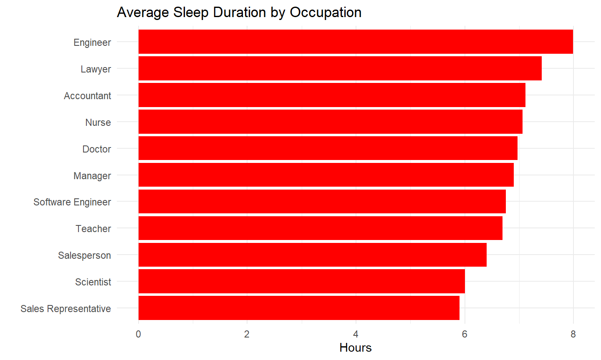
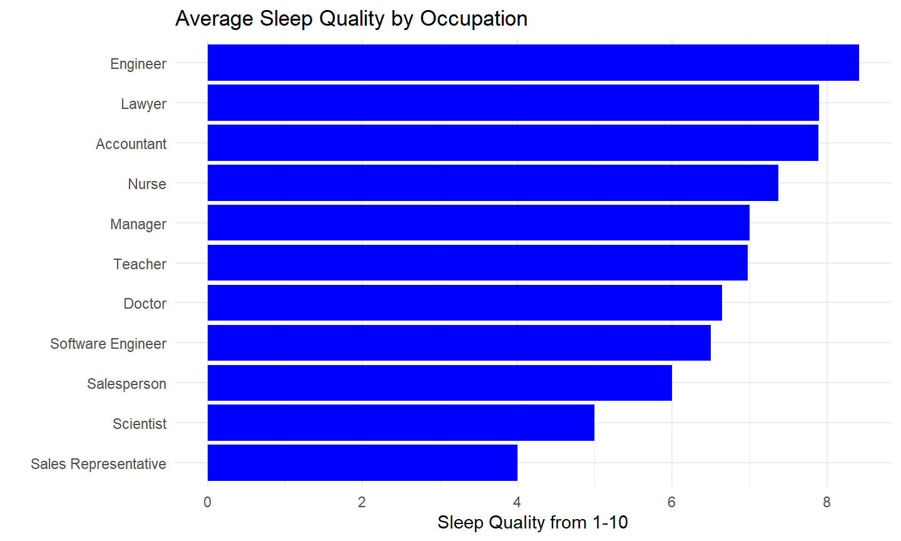
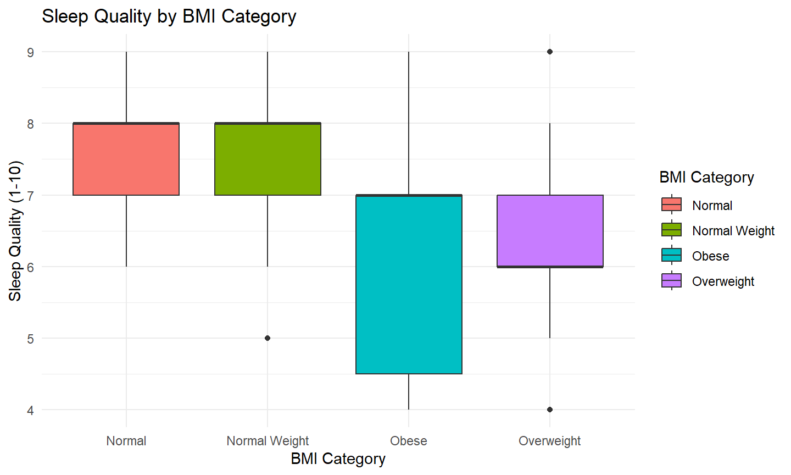
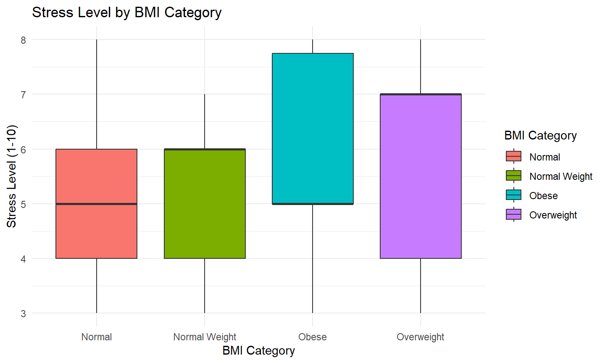
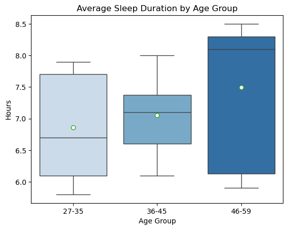
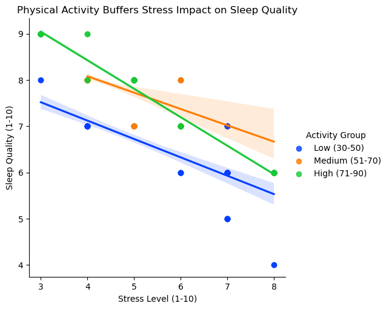
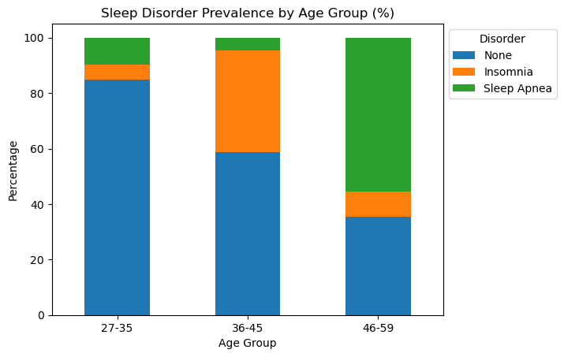

# Sleep Health and Lifestyle Data Analysis

Exploratory data analysis using **R and Python** to examine relationships between sleep, occupation, BMI, physical activity, stress, age, and sleep disorders.

## Project Overview

This project analyzes the **Sleep Health and Lifestyle Dataset** from Kaggle. I used both R and Python to explore different questions related to sleep health and lifestyle factors.

The project consists of two related analyses:

- **R Analysis:** Examines how occupation and BMI category relate to sleep duration, sleep quality, and stress levels.
- **Python Analysis:** Examines relationships between physical activity, stress, sleep quality, age, sleep duration, and sleep disorder prevalence.

# R Analysis

### Questions

1. Do certain occupations report shorter sleep duration or lower sleep quality scores?
2. How does BMI category relate to self-reported sleep quality and stress levels?

### Methods

- Data cleaning and preparation
- Grouping and summarizing data
- Exploratory data analysis
- Data visualization with `ggplot2`
- Comparison of sleep duration and sleep quality across occupations
- Comparison of sleep quality and stress levels across BMI categories

### Visualizations









## Python Analysis

### Questions

1. Does higher physical activity buffer the negative impact of stress on self-reported sleep quality?
2. How do sleep duration and sleep disorder prevalence vary across age groups?

### Methods

- Data cleaning and preparation with `pandas`
- Exploratory data analysis
- Data visualization with `matplotlib` and `seaborn`
- Comparison of sleep patterns across age groups
- Examination of physical activity, stress, and sleep quality
- Analysis of sleep disorder prevalence across age groups

### Visualizations







## Tools

- **R**
- **Python**
- **Jupyter Notebook / Google Colab**
- **pandas**
- **matplotlib**
- **seaborn**
- **ggplot2**

## Data

The project uses the **Sleep Health and Lifestyle Dataset** created by Laksika Tharmalingam and obtained from Kaggle.

The dataset contains 374 observations and 13 variables covering factors such as age, occupation, sleep duration, sleep quality, physical activity, stress level, BMI category, and sleep disorder.

See [`data/README.md`](data/README.md) for the dataset source.

## Project Files

```text
R/
  Project1.Rmd

Python/
  sleepHealthProject2.ipynb

data/
  README.md

images/
  R and Python visualizations
